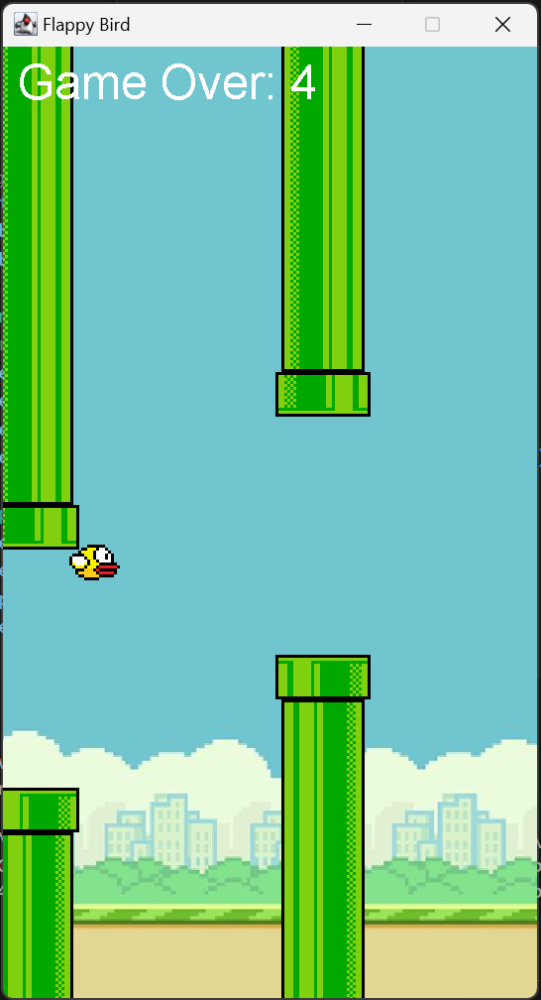

# 🐦 Flappy Bird Game in Java (Swing)

Play the classic Flappy Bird game right on your desktop, recreated in Java with Swing! This project brings the simple, addictive gameplay to a Java environment, complete with custom graphics and animation. Fly the bird through the pipes, gain points, and try to beat your high score!


## ✨ Features:
- **Classic Gameplay**: Flap your bird through randomly generated pipes and earn points.
- **Score Tracking**: See your score on the screen as you progress.
- **Custom Graphics**: Enjoy the nostalgic visuals with custom background, bird, and pipe images.
- **Game Restart**: Easily restart by pressing SPACE after a game over.


## 💻 Technologies Used
- **Java**: Programming language for the game logic and overall functionality.
- **Swing**: GUI components for rendering graphics, handling key events, and managing the game window.
- **Images**: Custom images for the bird, pipes, and background.


## 🚀 Setup Instructions
To get the game running on your system, follow these steps:

### Prerequisites:
Java Development Kit (JDK): Make sure you have Java installed on your machine. Download JDK

### Adding Images:
Place the required images (flappybird.png, flappybirdbg.png, toppipe.png, bottompipe.png) in the project directory.

### Compile and Run:
Compile the project:
```bash
javac App.java
```

Run the game:
```bash
java App
```

## 🎮 How to Play

- **Start the Game**: Run the App.java file.
- **Jump**: Press the SPACE key to make the bird jump.
- **Game Over**: If you collide with a pipe or fall out of bounds, the game ends.
- **Restart**: Press SPACE after a game over to start again.


## 📷 Screenshots

